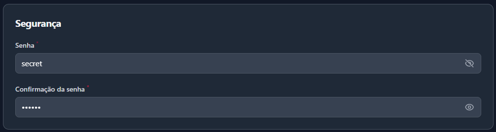

# Filament Password Input

Plugin built for Filament package with Laravel framework.
This input shows/hides the password when clicking on the eye

## Installation

Install via composer:

```bash
composer require papalardo/filament-password-input
```

## Result


## Usage

```php
use Illuminate\Validation\Rules\Password as PasswordRule;
use Papalardo\FilamentPasswordInput\PasswordInput;

class UserPasswordForm
{
    public static function inputs(): array
    {
        return [
            PasswordInput::make('password')
                ->label('Senha')
                ->required()
                ->rules(['confirmed', PasswordRule::min(8)]),

            PasswordInput::make('password_confirmation')
                ->label('Confirmação da senha')
                ->required(),
        ];
    }
}
```
